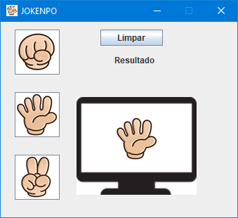
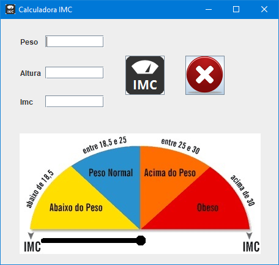
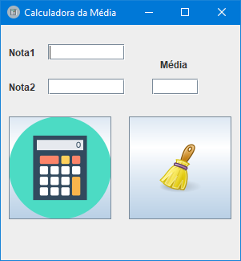
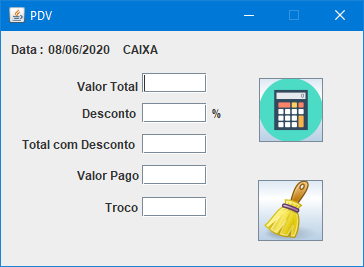
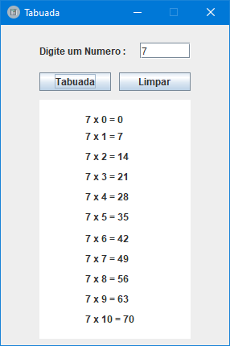

# Portifolio
<h2>Portfólio de algumas atividade feitas em Java</h2>
 
 
<h2>Tela Principal</h2>

 
 
<h2>Média de idades</h2>

 
 
<h2>Jokenpo, Usuário x Máquina</h2>

 
 
<h2>Calculadora de índice de massa corporal - IMC</h2>

 
 
<h2>Média de notas</h2>

 
 
<h2>PDV - Ponto de Vendas</h2>

 
 
<h2>Resultado do termometro</h2>

 
 
<h2>Tabuada</h2>

 
 
